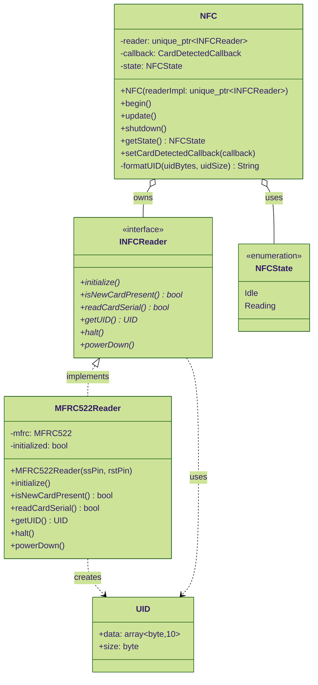
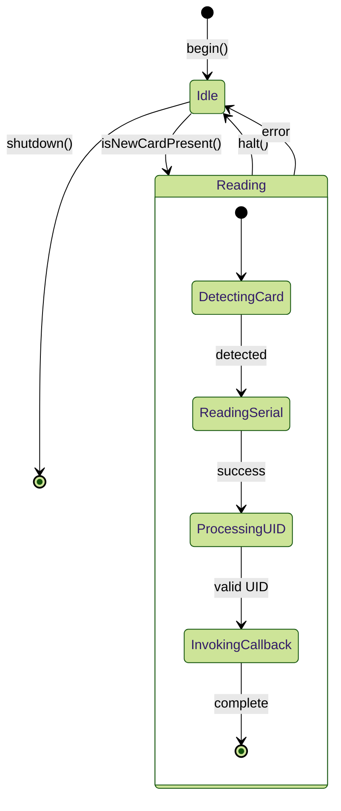
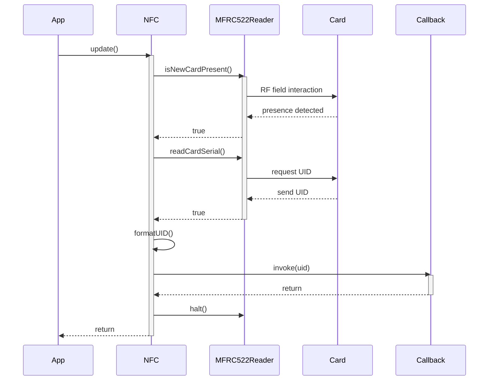
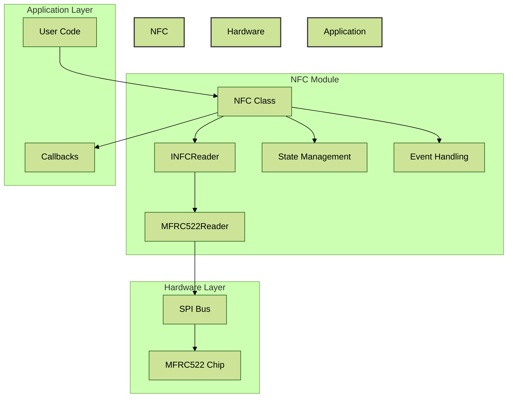
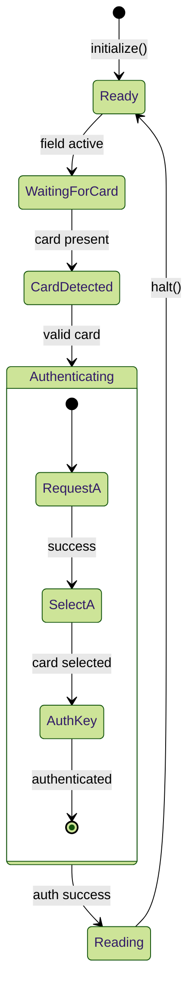

# NFC Module

A robust, SOLID-compliant NFC/RFID module for ESP32 and similar microcontrollers. This module provides a clean interface for NFC card detection and reading, with support for multiple hardware implementations.

## Features

- Interface-based design for hardware abstraction
- MFRC522 RFID reader support
- Comprehensive error handling
- Power management
- Event-based card detection
- Thread-safe operations
- Extensive test coverage

## Installation

1. Include the module in your project:
```cpp
#include "modules/nfc/nfc.h"
#include "modules/nfc/mfrc522_reader.h"
```

2. Create an instance with MFRC522 hardware:
```cpp
auto reader = std::make_unique<MFRC522Reader>(SS_PIN, RST_PIN);
NFC nfc(std::move(reader));
```

## Usage

### Basic Usage

```cpp
// Initialize the module
nfc.begin();

// Set up card detection callback
nfc.setCardDetectedCallback([](const String& uid) {
    Serial.print("Card detected: ");
    Serial.println(uid);
});

// In your main loop
void loop() {
    nfc.update();
    // ... other tasks
}
```

### Power Management

```cpp
// Put the module in low-power mode
nfc.shutdown();

// Resume operations
nfc.begin();
```

## Development

### Prerequisites

- CMake 3.10 or higher
- C++17 compatible compiler
- Docker (for development container)

### Development Container

This project includes a devcontainer configuration for VSCode. To use it:

1. Install the "Remote - Containers" extension in VSCode
2. Open the project in VSCode
3. Click "Reopen in Container" when prompted

### Building

```bash
# Configure
cmake -B build -DCMAKE_BUILD_TYPE=Debug -DBUILD_TESTING=ON

# Build
cmake --build build

# Run tests
cd build && ctest --output-on-failure
```

### Running Tests in Docker

```bash
# Build and run tests
docker-compose run test

# Run static analysis
docker-compose run analysis
```

## Testing

The module includes comprehensive tests covering:

- Basic functionality
- Error handling
- Edge cases
- State transitions
- Power management
- Stress testing

### Running Tests

```bash
# All tests
ctest --output-on-failure

# Specific test
./build/test/nfc_tests --gtest_filter=NFCTest.CardDetectionTest
```

## Code Quality

The codebase is maintained with strict quality standards:

- SOLID principles compliance
- Static analysis with clang-tidy
- Format checking with clang-format
- Additional checks with cppcheck and cpplint

### Running Quality Checks

```bash
# Run all checks
./scripts/run-analysis.sh

# Format code
clang-format -i src/modules/nfc/*.{cpp,h}
```

## Architecture

The module follows SOLID principles:

- **Single Responsibility**: Each class has a single, well-defined purpose
- **Open/Closed**: New reader implementations can be added without modifying existing code
- **Liskov Substitution**: All reader implementations are interchangeable
- **Interface Segregation**: Clean, minimal interfaces
- **Dependency Inversion**: High-level module depends on abstractions

### Class Diagram


### State Diagram


### Sequence Diagram: Card Detection


### Component Integration


### Protocol State Machine


## Contributing

1. Fork the repository
2. Create a feature branch
3. Make your changes
4. Run tests and quality checks
5. Submit a pull request

## License

MIT License - see LICENSE file for details
